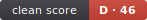

# cleanscore



> 네, 우리도 **D**입니다. 엔진이 1,100줄짜리 단일 파일이라서요. 툴은 자기한테도 안 봐줍니다 — 그게 요점입니다. ([랜딩](https://yoo-minho.github.io/cleanscore))

**3분 만에 코드베이스를 채점한다.** 정적 분석 · 100% 로컬 · LLM 0 · A+ ~ D 등급.

```bash
npx cleanscore --dir=src
```

명령 한 줄, 설정 제로. 코드는 컴퓨터 밖으로 한 발짝도 안 나간다. 인지 복잡도·중복·데드코드·루프 IO(N+1)를 재서 하나의 등급으로 뽑는다.

```
청결도: B (78점) — 함수 4,908개 · 중복 15% · 데드 12개
```

---

## 유명 오픈소스, 실제 점수

같은 자로, 예외 없이 채점한 결과다.

| # | 프로젝트 | 등급 | 점수 | 핵심 지표 |
|---|----------|------|------|-----------|
| 1 | mitt | **A+** | 100 | 중복 0% · cog 최대 4 |
| 2 | execa | **A+** | 99 | 중복 0.7% |
| 3 | zustand | **A+** | 93 | 중복 0% |
| 6 | jotai | **A+** | 91 | 상태관리 |
| 7 | immich (NestJS 앱) | **A** | 89 | 518파일 · 중복 3.1% |
| 10 | express | **A** | 82 | 웹 프레임워크 |
| 11 | ky | **B** | 76 | cog 최대 92 (밀도) |
| 12 | excalidraw (앱) | **B** | 76 | 420파일 · cog 최대 189 |
| 13 | zod | **C** | 66 | 중복 16% |
| 15 | hono | **C** | 64 | 중복 23% |
| 16 | valibot | **D** | 57 | 중복 43% (수백 유사 모듈) |
| — | 병적 코드 (대조군) | **D** | 36 | 중복 100% · 함수 전부 괴물 |

> **valibot이 D다.** 근데 이건 "나쁜 코드"가 아니라 수백 개의 거의 동일한 스키마 모듈 = 구조적 중복이 높다는 뜻이다. **점수는 판결이 아니라 측정이다.** 무엇을 재는지 전부 아래에 공개한다. 자가 마음에 안 들면 계수를 바꿔라 — 오픈소스니까.

---

## 무엇을 재는가

| 축 | 설명 |
|----|------|
| **인지 복잡도** | 함수당 중첩·분기 가중 복잡도. 사람이 못 읽는 괴물 함수를 지목한다. |
| **중복** | 토큰 단위 복붙 검출. 변수명만 바꾼 위장은 잡되, 구조적 유사는 관용한다. |
| **데드코드** (`--dead`) | knip 내장. 죽은 파일·미사용 export를 감점. `// @keep` 주석으로 "코드 밖 호출자"(크론·웹훅·QR)를 살려둔다. |
| **루프 IO / N+1** | 루프 안에서 파일을 N번 읽거나 DB/HTTP를 순차 await 하는 구조. SonarQube가 원리상 못 잡는 N+1을 드러낸다. |
| **O(n²) 배열 조회** | 루프 안에서 루프 밖 배열에 `find`/`findIndex`/`some`을 돌리는 자리. Map/Set 한 번이면 O(n). 취향이 개입하지 않는 기계적 개선이라 외부 기여(PR)로도 안전하다. *(진단 전용 — 점수 미반영)* |

---

## 왜 믿나 — 점수는 방어할 수 있어야 점수다

- **게임 불가** — 비율은 코드 질량 기준. 빈 파일을 8,000개 넣어도 점수는 그대로다 (코드 5줄 미만은 분석에서 제외).
- **OSS 17종으로 보정** — 계수는 존경받는 오픈소스 라이브러리·앱 분포에 맞춰 역산했다. 임의의 임계값이 아니다. (중앙값 A/B)
- **네거티브 컨트롤** — 일부러 만든 병적 코드(중복 100%, 함수 전부 괴물)를 검증용으로 채점 → 정확히 최하위(38점 D).
- **투명한 의견** — "객관적 청결"이란 없다. 이건 일관되고 공개된 렌즈다. 재는 축, 보정 레포, 대조군을 전부 공개한다.
- **실전 검증** — 등급만 매기는 게 아니라 진짜 고칠 것을 짚는다. cleanscore가 실제 OSS에서 찾아 PR 낸 이슈 기록: [**실전 성과 →**](./IMPACT.md) (머지 1건당 +1점)

---

## 사용법

```bash
# 기본 — git 추적 파일만, 빌드 산출물 자동 제외
npx cleanscore --dir=src

# 데드코드 축 추가 (knip 내장, 프로젝트 전체 1회 훑음)
npx cleanscore --dir=src --dead

# README 배지 생성 (SVG + 붙이는 마크다운 스니펫)
npx cleanscore --dir=src --badge
```

### README에 붙이기

`--badge`는 `cleanscore.svg`를 생성한다. 커버리지 배지처럼 README에 박으면 된다:

```md

```

`clean score | A+ · 100` — 등급 색으로 렌더된다 (A+/A 초록, B 골드, C 주황, D 빨강).

결과는 `--out` 디렉토리에 `kit-stats.json`으로도 떨어진다 (CI 추이 추적용).

---

## 등급

| 등급 | 점수 |
|------|------|
| A+ | ≥ 90 |
| A | ≥ 80 |
| B | ≥ 70 |
| C | ≥ 60 |
| D | < 60 |

---

## 라이선스

MIT
